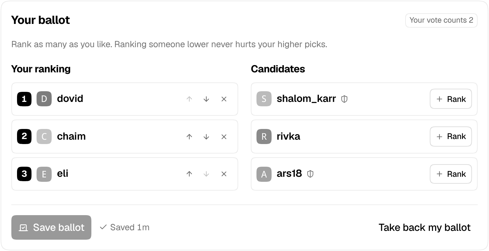

# Mod elections: the forum picks its moderators

Every few months the forum elects its moderators. Anyone in good standing can run, members rank the candidates, and the count is published stage by stage so anyone can follow how each seat was won. Admins stay as they are: they never run and never vote.

## How an election runs

1. **Nominations** open at midnight on the 1st of each scheduled month (January, April, July and October by default) and last a week. The sitting moderators are on the ballot already and can drop out. Anyone else who can run signs up on `/elections` and writes a few lines about themselves.
2. **Vote Week** follows. Voters rank as many candidates as they like, best first, and can change or take back their ballot until it ends. Each voter sees the candidates in their own shuffled order, so nobody is always at the top.
3. **The count.** When Vote Week ends, admins get a notification. On the Mod elections tab they check for ballots cast from one address, set aside any that are alt accounts (with a reason the voter sees), preview the count and the moderator changes it makes, then publish.

Publishing makes the winners moderators and takes moderator rights from the sitting moderators who weren't elected. All the seats are up every time.

There's a page at `/elections` (linked from the sidebar's *More* list), a banner while nominations are open and for voters who haven't voted yet, and notifications when Vote Week opens and a day before it ends. Dumbcourse has the same page: on a flip phone, pick a candidate and press 1–9 to put them in that place, or 0 to take them off.

If a category is set, each election gets a topic there: the schedule when nominations open, the candidates when Vote Week opens, and the winners when the results are published. Candidates are linked, not @mentioned.

## Who can run and who can vote

- **Running:** trust level 2 or higher, an account at least 90 days old, and no suspension or silence in the last 180 days. Sitting moderators can always run. Admins can't. An admin can take a candidate off the ballot, but has to give a reason, and it's shown on the page.
- **Voting:** the voter list is fixed when nominations open. It has every account at least 30 days old at trust level 1 or higher, not suspended, silenced or staged, and not an admin. **A vote counts as much as the voter's trust level** at that moment, so trust level 3 counts 3 and trust level 0 doesn't vote. New accounts and level-ups during the election change nothing. Accounts suspended or silenced since can't vote. Candidates vote too, just not for themselves.

All of these are settings.

## The count

The count is the single transferable vote, as used for Ireland's elections:

- With 3 seats, a candidate needs just over a quarter of the votes to win (the Droop quota).
- Everyone's first choice is counted. Anyone over the quota is elected, and the votes they didn't need move on to their voters' next choices at a reduced value.
- When nobody is over the quota, whoever has the fewest votes is out and their ballots move to each voter's next choice.
- This repeats until every seat is filled.

Ranking someone lower never hurts your higher choices: your next choice only counts once your earlier ones have won or are out. A tie goes to whoever did better at the earliest stage where they differed, and if they were level at every stage, it's drawn by lot. The lot's seed is drawn when voting closes and published with the results, so the preview and the published count always agree, and anyone can check a draw.

The results show every stage, the turnout and the quota. Who ranked whom is never shown to anyone: ballots are tied to accounts so nobody votes twice, and admins see only who voted from which address, never a ballot's contents. The addresses are deleted when the results are published.

If fewer people run than there are seats, they're elected unopposed and the rest stay empty until admins appoint someone. If nobody voted in a contested election, it can't be published: cancel it and the moderators stay as they are.

## Former moderators and strikes

Anyone who wins a seat is locked at trust level 4, and keeps it after leaving the seat, so trust level 4 marks people who were moderators. Trust level 4 can still edit posts and close, move and rename topics, so former moderators keep those powers (`mod_elections_former_mods_keep_tl4` turns this off).

A sitting moderator who runs again and loses gets a strike. At the second strike they go back to trust level 3, unlocked, and the usual trust level 3 rules apply again. Stepping down, not running, and losing while not in a seat give no strike.

## Seats between elections

On the Mod elections tab an admin can mark a moderator as **stepped down** (they keep trust level 4) or **removed for abuse** (back to trust level 3). Either way the seat can be filled by **countback**: the same ballots are counted again without the people who left, and the first newly elected candidate takes the seat. No new vote.

## Starting one by hand

The tab can also start an election off the calendar, with its own dates and number of seats, end a phase early, or cancel an election. A cancelled election stays cancelled; the schedule won't start it again.

## Settings

Admin → Plugins → Jtech Tools → **Mod elections**. The full text of each setting is shown next to it in the admin.

| Setting | Default | What it does |
| --- | --- | --- |
| `mod_elections_enabled` | `false` | Lets the forum elect its moderators. |
| `mod_elections_seats` | `3` | How many moderators each election picks. |
| `mod_elections_schedule_months` | `1\|4\|7\|10` | Months an election starts in. |
| `mod_elections_timezone` | `America/New_York` | Time zone the calendar runs in. |
| `mod_elections_nomination_days` | `7` | How long nominations stay open. |
| `mod_elections_voting_days` | `7` | How long Vote Week lasts, starting when nominations close. |
| `mod_elections_candidate_min_trust_level` | `2` | Lowest trust level that can run. |
| `mod_elections_candidate_min_account_age_days` | `90` | How old an account has to be to run. |
| `mod_elections_candidate_clean_record_days` | `180` | Accounts suspended or silenced within this many days can't run. |
| `mod_elections_statement_max_length` | `1000` | Longest statement a candidate can write about themselves. |
| `mod_elections_voter_min_account_age_days` | `30` | How old an account has to be, when nominations open, to vote. |
| `mod_elections_former_mods_keep_tl4` | `true` | Moderators who leave their seat keep trust level 4, locked. |
| `mod_elections_strikes_before_tl3` | `2` | At this many strikes a former moderator goes back to trust level 3. |
| `mod_elections_category` | (blank) | Category for each election's topic. |
| `mod_elections_notify_voters` | `true` | Sends voters a notification when Vote Week opens, and a reminder a day before it ends. |

[← All features](../README.md#features)
