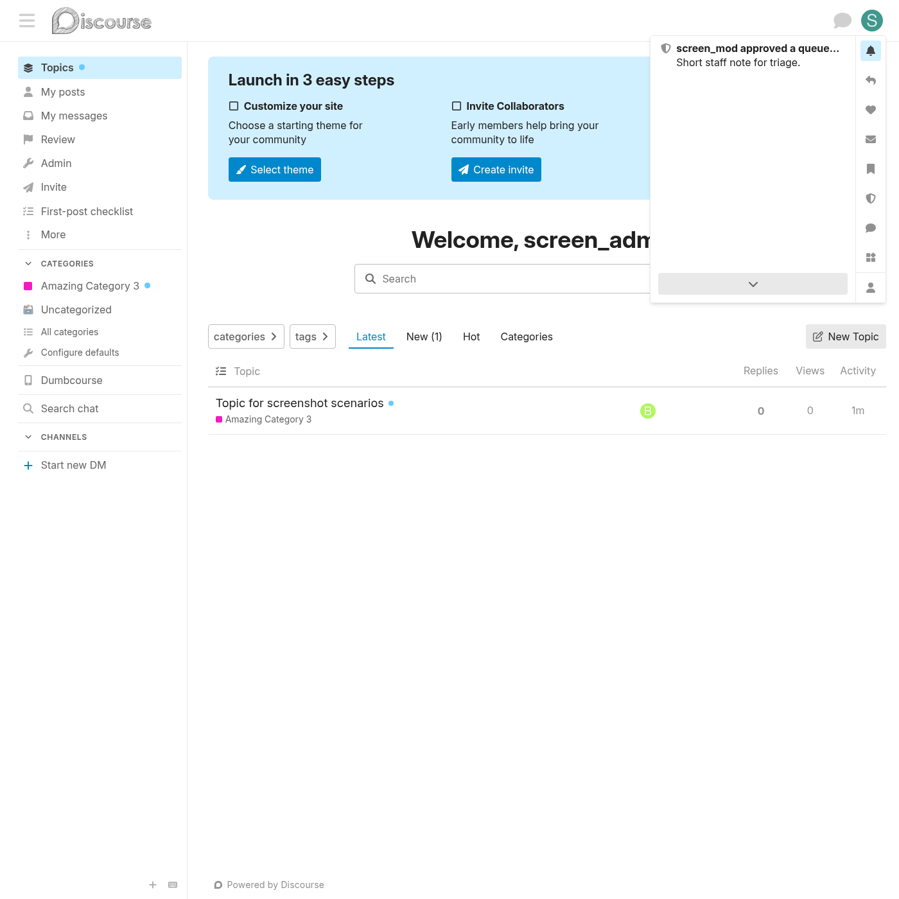
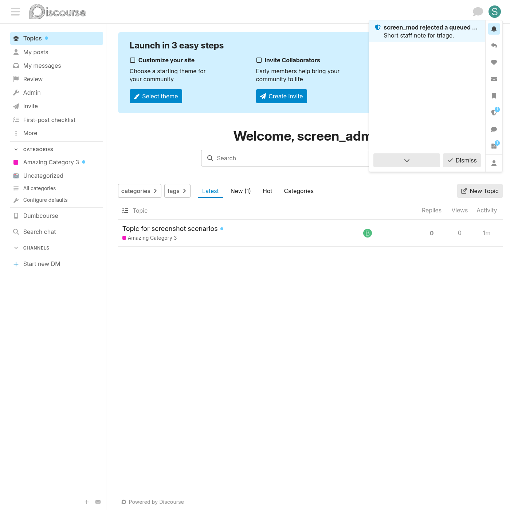
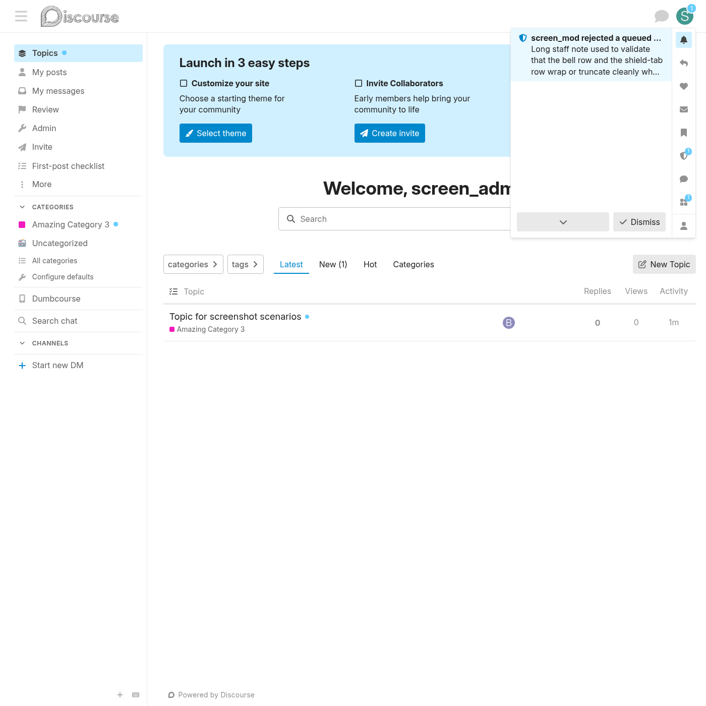
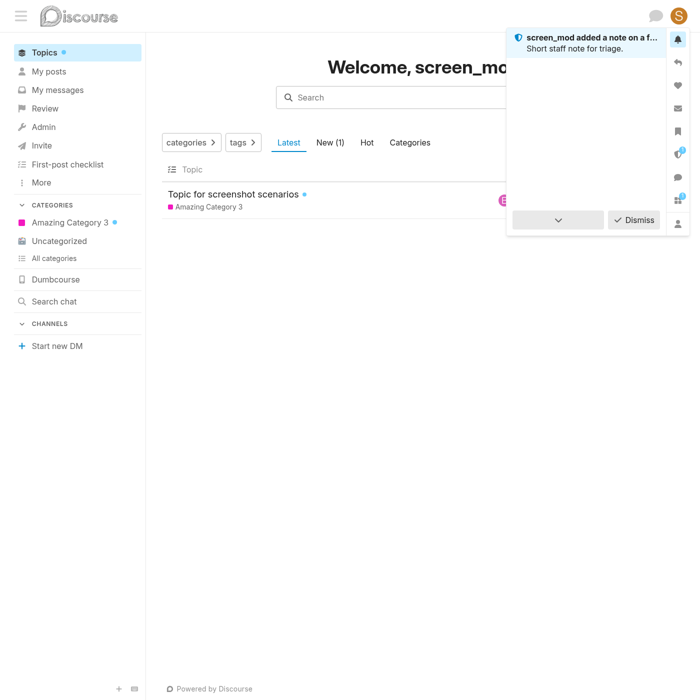
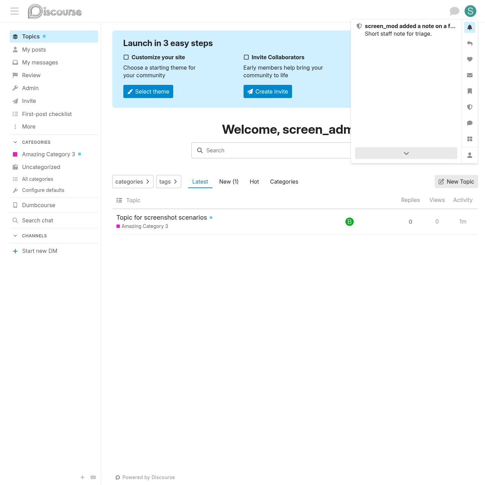
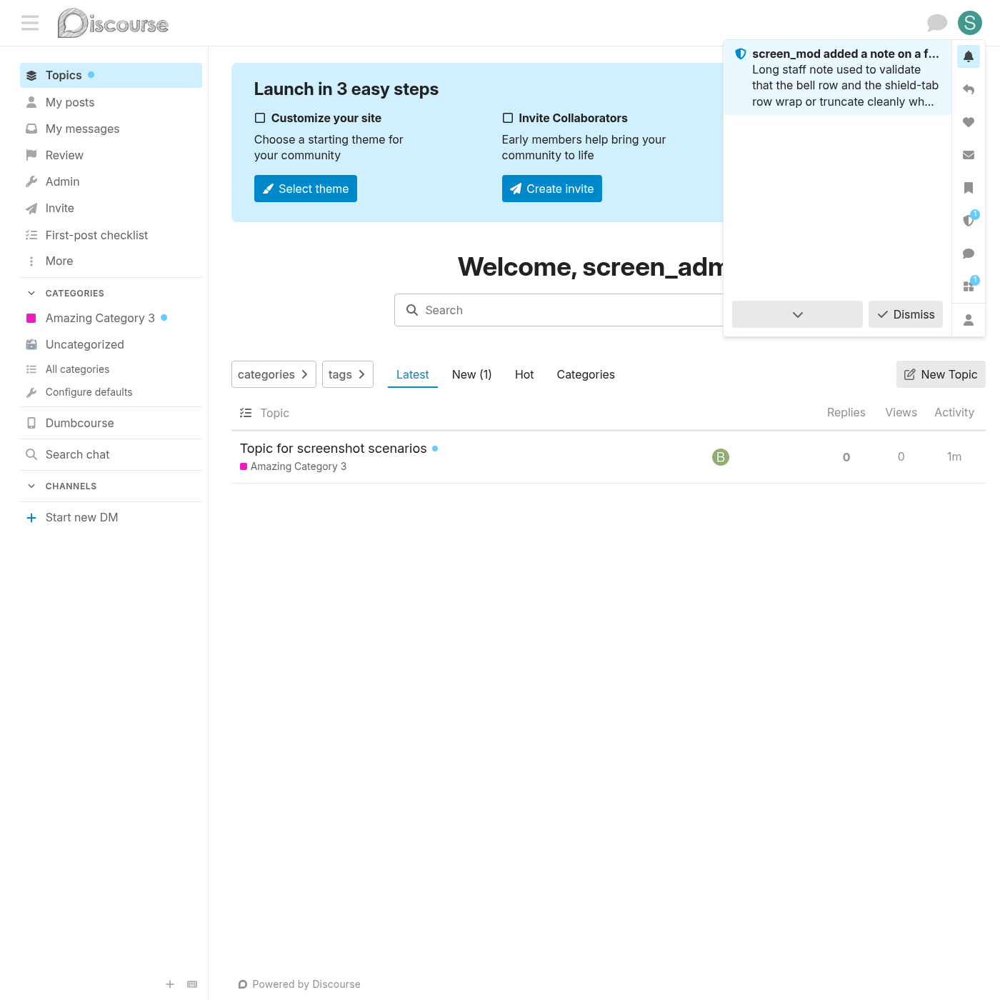
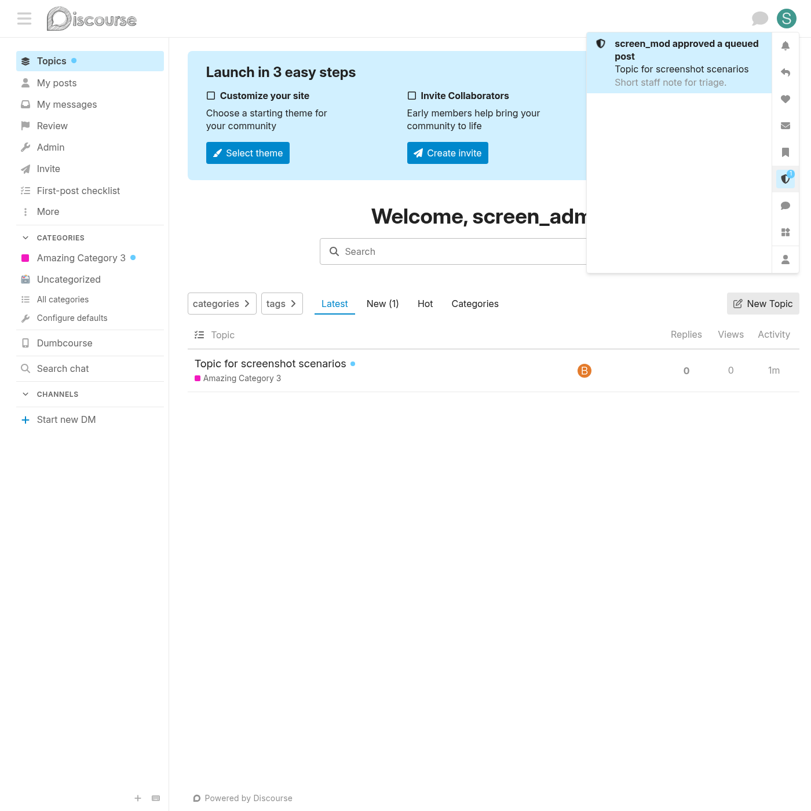
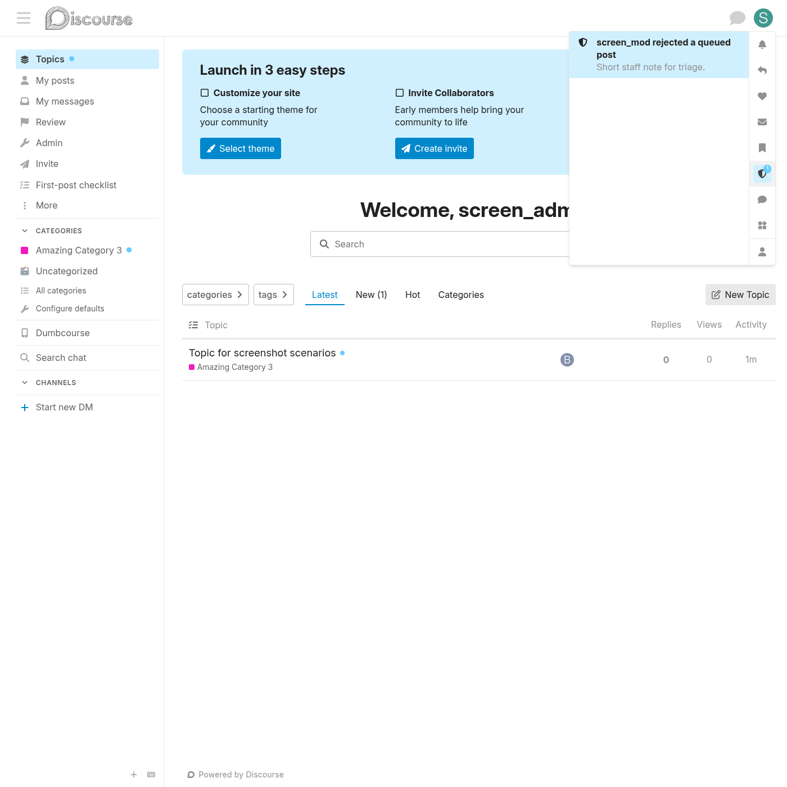
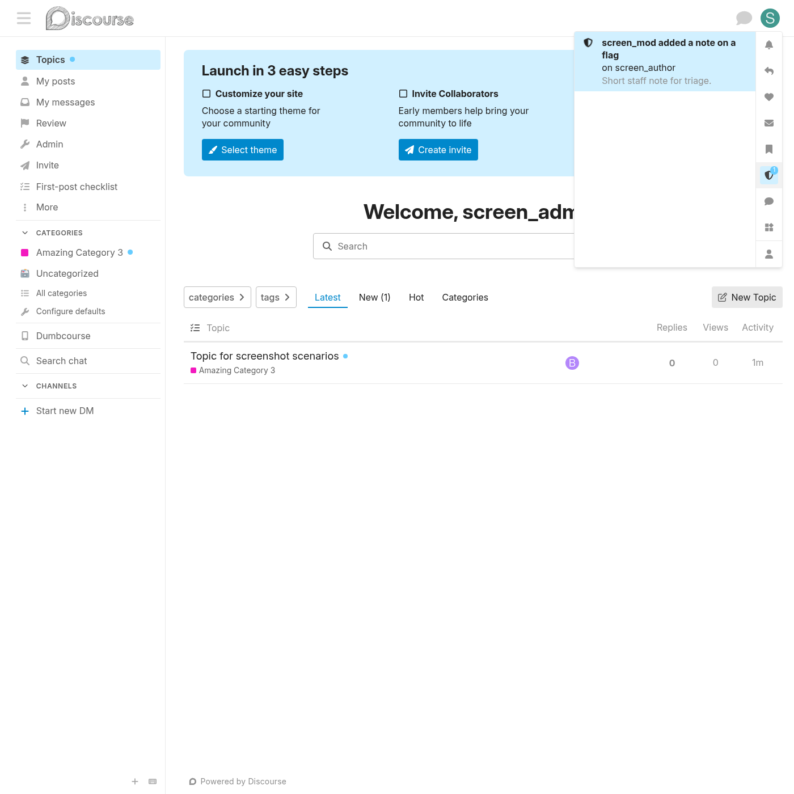
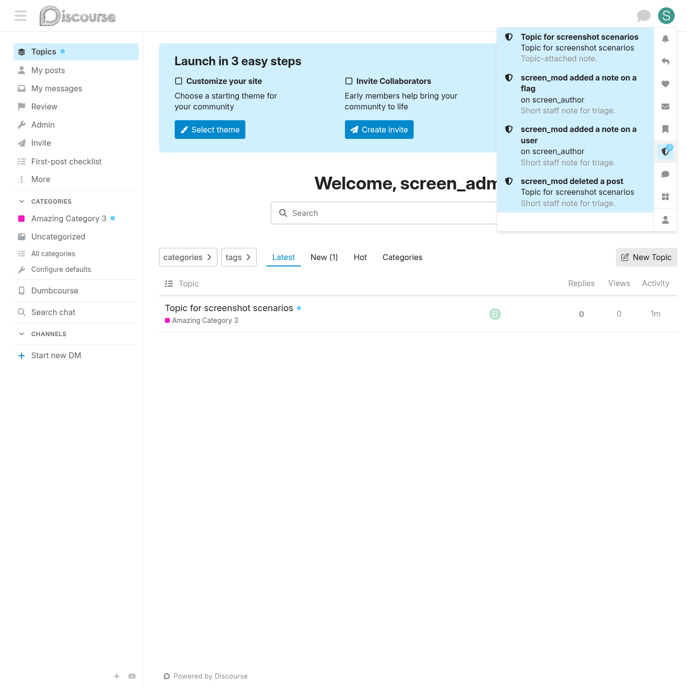

# Review-queue notifications — visual walkthrough

This doc shows what each review-queue notification looks like in the bell dropdown and in the moderator-notes shield tab. Three kinds are covered:

1. **`post_approved`** — fires when a moderator approves a queued post via the review queue
2. **`post_rejected`** — fires when a moderator rejects a queued post
3. **`flag_note`** — fires when a moderator adds a `ReviewableNote` to a flag

All screenshots are pulled from the run [26777273730](https://github.com/Shalom-Karr/JtechTools/actions/runs/26777273730) (commit `ac24dc7`).

## Honest test-coverage status

| Kind | Unit test | Integration test | End-to-end against real Discourse |
| --- | --- | --- | --- |
| `post_rejected` | ✅ passes | ✅ passes (`/review/:id/perform/reject_post.json`) | ❌ not verified |
| `flag_note` | ✅ passes | ✅ passes (`/review/:id/notes.json`) | ❌ not verified |
| `post_approved` | ⚠ removed (was flaky on this Discourse version's `let_it_be` + ReviewableHistory interaction) | ⚠ reduced to "endpoint returns 2xx" — does NOT verify the notification fires | ❌ not verified |

**Both `post_approved` and `post_rejected` go through the same `:reviewable_transitioned_to` callback in `sub_plugins/mod_categories.rb` and the same fan-out path in `lib/discourse_mod_categories/staff_notifier.rb`. The code path is identical except for the status symbol** (`:approved` vs `:rejected`). Confidence that `post_approved` works is therefore *high but not proven*. To convert that to proven, this is the gap to close:

```ruby
# Add to spec/requests/staff_event_notifications_spec.rb
it "fans out a post_approved notification on :reviewable_transitioned_to(:approved)" do
  seed_acting_history(reviewable_queued, moderator)
  DiscourseEvent.trigger(:reviewable_transitioned_to, :approved, reviewable_queued.reload)
  expect(staff_notifications(admin, kind: "post_approved").count).to eq(1)
end
```

The reason I removed this previously was a cache-pollution issue between specs. With the `Synonyms.reload!` cache-clear pattern now in place, it should be safe to add back — but it isn't there yet.

## Bell-row visuals

### `post_approved` — bell row

The notification shown in the standard Discourse notification dropdown when a queued post is approved. Title format is "{username} approved a queued post".

| Variant | Screenshot |
| --- | --- |
| Admin viewer, unread, short excerpt |  |
| Moderator viewer, unread, short excerpt |  |
| Admin viewer, read state (no badge) |  |
| Long excerpt (truncation check) |  |

### `post_rejected` — bell row

Same visual layout, different label. Title: "{username} rejected a queued post". URL on click: `/review/:id` (since there's no resulting post to link to).

| Variant | Screenshot |
| --- | --- |
| Admin viewer, unread, short excerpt |  |
| Moderator viewer, unread, short excerpt |  |
| Admin viewer, read state |  |
| Long excerpt |  |

### `flag_note` — bell row

Fires when a moderator adds a `ReviewableNote` (the "Add a note" textarea on a flag's detail panel in `/review`). Title: "{username} added a note on a flag". Click URL: `/review/:id`.

| Variant | Screenshot |
| --- | --- |
| Admin viewer, unread, short excerpt |  |
| Moderator viewer, unread, short excerpt |  |
| Admin viewer, read state |  |
| Long excerpt |  |

## Shield-tab visuals (user-menu)

The same notification rows also appear in the staff-only shield tab (the user menu's "Moderator notes" tab). Click any row to land on `/review/:id`.

| Scenario | Screenshot |
| --- | --- |
| Shield tab with a single `post_approved` event |  |
| Shield tab with a single `post_rejected` event |  |
| Shield tab with a single `flag_note` event |  |
| Shield tab with mixed kinds — topic-attached note + flag_note + user_note + post_deleted |  |

## What's NOT shown here

These exist in the `893-shot artifact` but didn't make it into this curated set:

- Live MessageBus pop-up alerts (the small toast that appears when a notification arrives while the user has the tab open) — Capybara screenshots are static; the toast renders for ~5 seconds then auto-dismisses.
- `/review/:id` landing page itself (vanilla Discourse — not affected by this plugin).
- The full review-queue panel where the mod actually clicks "approve / reject / add note" — vanilla Discourse UI; not modified by this plugin.

If you want any of those captured, the full 893-shot artifact is at the run linked above.
